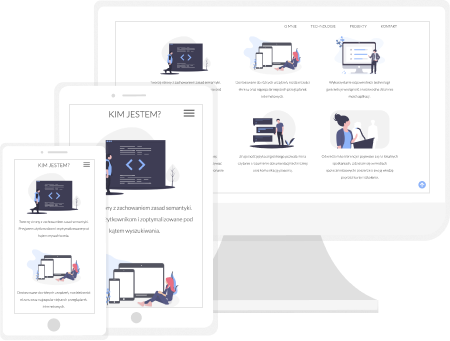

# Todo App

> My personal portfolio containing sections with information about me, technologies which I use and my completed projects. There is also a contact form if you would like to message me.

## Table of contents
* [Technologies](#technologies)
* [Setup](#setup)
* [Preview](#preview)
* [Status](#status)
* [Contact](#contact)

## Technologies
* HTML5
* CSS3
* JavaScript ES6
* npm
* gulp
* Figma

## Setup
If you want to run my website locally, enter the following commands in console:

`npm install -g gulp-cli`

`npm install`

`gulp`

## Preview
To live preview of my project visit this website: [Portfolio](https://jakub-matusiak.github.io)

## Status
Project is _completed_.

## Contact
Created by [Jakub Matusiak](https://github.com/jakub-matusiak) - feel free to contact me!